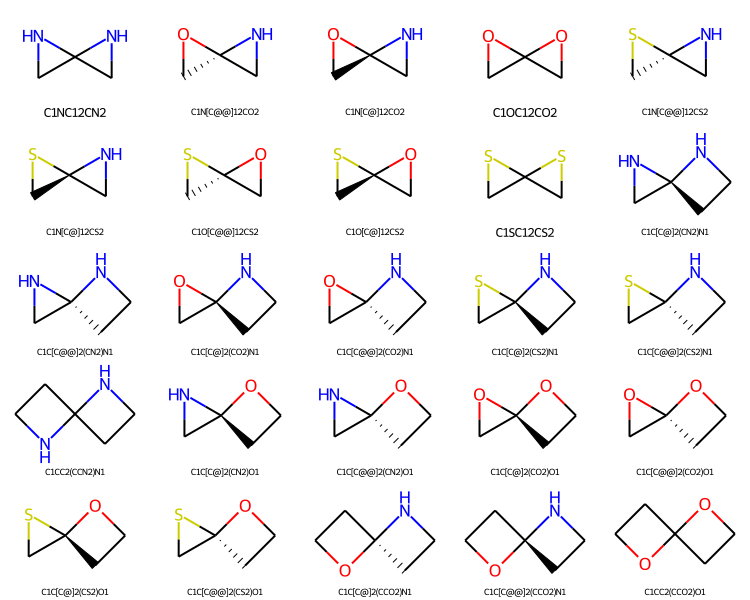
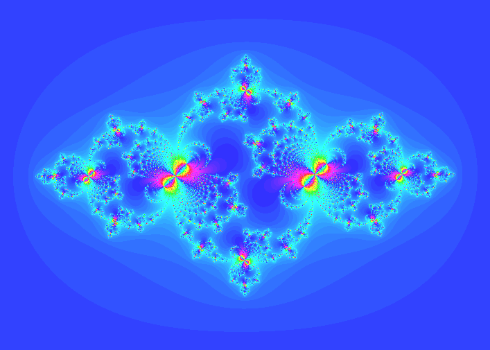

# My portfolio

There is some projects I have done and want to share

From recent to old:

- **Chemical space enumeration**
- **Clinic**
- **Web Monaco report**
- **Unique characters**
- **Telebot: telegram chat bot**
- **Cellular automaton: wildfire simulation**
- **Fractals on Delphi**

## [Chemical space enumeration](https://github.com/hendelbah/portfolio/tree/master/chem_space_enumeration)

  

An application for combinatorial generation and processing of spirocyclic molecular structures.

This app is a part of my master's graduation project.

It uses:

- **RDKit** - an opensource chemoinformatics library
- **pandas**

## [Clinic](https://github.com/hendelbah/clinic)

A web app for managing appointments in a clinic. There is a web interface and REST API.

This is a final project for EPAM Python courses. It is well documented
and covered with tests

It uses:

- **Flask, Jinja, SQLAlchemy, Marshmallow, WTForms, flasgger**
- **HTML, CSS, MySQL, JSON**
- **REST API, OpenAPI**
- **unittest**

## [Web Monaco report](https://github.com/hendelbah/portfolio/tree/master/web_monaco_report)

A web application for showing Monaco 2018 Racing statistics. There is a web interface and REST API.

This is a project for FoxmindEd Python courses. It is well documented
and covered with tests

It uses:

- **Flask, Jinja, peewee, flasgger**
- **HTML, CSS, PostgreSQL, JSON, XML**
- **REST API, OpenAPI**
- **pytest**

## [Unique characters](https://github.com/hendelbah/portfolio/tree/master/unique_characters_package)

A small application that contains tools for finding unique characters in given string.

This is a project for FoxmindEd Python courses, for working with packaging and CLI.
It is well documented and covered with tests(pytest).

It is performed as a python package and has importable utilities and also CLI

It uses:

- **collections**
- **argparse**
- **pytest**

## [Telebot](https://github.com/hendelbah/portfolio/tree/master/telebot)

**This and the next projects I had made before I decided to become a
professional programmer, they are a bit messy.**

The telegram bot for managing certain common situations in a chat of
employees of Enamine Ltd.

I had made it just out of interest, but unfortunately it didn't find any real
life application.

It uses:

- **pyTelegramBotAPI**
- **SQL: Sqlite3**
- **OOP**

## [Cellular automaton: Wildfire simulation](https://github.com/hendelbah/portfolio/tree/master/cellular_automaton)

<picture>
 
</picture>
<picture>
 
</picture>

Application that simulates wildfire using cellular automata model. In the result
it creates a GIF file that illustrates wildfire dynamics.

This was a project for my lab work at the university(indeed, we had some
programing subjects when studied chemistry).

It is performed in OOP style and has GUI.

It uses:

- **TKInter, pillow, numpy**
- **OOP**

## [Fractals](https://github.com/hendelbah/portfolio/tree/master/fractals-Delphi)

 

<picture>
 
</picture>
<picture>
 
</picture>

Application with GUI that visualizes Mandelbrot and Julia sets and can save
that as pictures and GIFs.

I did this project for fun 2 years ago when I didn't know python, using
Delphi I had been taught in school.

It was made with Embarcadero RAD studio IDE, and it uses external GifImage
library for saving GIF (it's quite large, so there is a lot of pascal content in repo).
