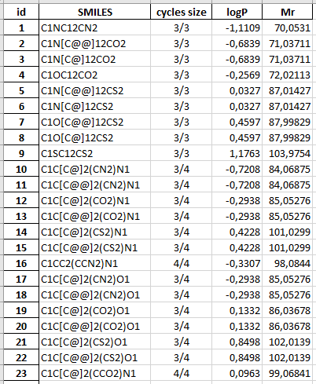

# The enumeration of chemical space

An application for combinatorial generation and processing of spirocyclic molecular structures.

This is a part of my master's graduation project.

## Purpose

The comprehensive enumeration and generation of all the theoretically possible chemical compounds,
the so-called *chemical space* is a problem in chemoinformatics and chemistry, that has attracted
the interest of scientists for a number of years. Assessing the chemical space has shown that it
contains about 10200 compounds and that makes impossible the generation of all the theoretically
possible structures. Therefore, the most practical way is to restrict researched area and deal only
with practically accessible compounds from particular class, exploring small part of chemical space.

## Features

This application allows one to enumerate small part of chemical space, namely spirocyclic
compounds with customizable restrictions. Also, the opensource chemoinformatics library
**RDKit** is used for processing enumerated structures.

**With this app you can:**

- Enumerate spirocycles, specifying ring size, number and set of heteroatoms, for each ring.
- Generate SMILES strings for enumerated molecules
- Create pictures of multiple 2D structures for all generated SMILES:

  
- Compute logP and mol weight, and create excel table from that data:

  

## Modules

- `enumeration.py` contains functions for enumeration and SMILES generation of spirocyclic compounds
  with specified set and amount of heteroatoms and specified ring sizes.
- `output_routines.py` contains functions, which from SMILES can generate PNG images of 2D structures,
  calculate properties(logP, MolWeight) and create excel table with these properties.
- `run.py` contains script with example of usage, that generates spirocycles with each ring containing
  up to 5 members and up to 2 atoms of N, O and S. Then it creates pictures of all molecules with 5x5
  grid of structures on each, and excel table with properties of these molecules